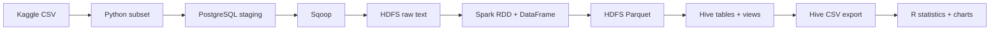
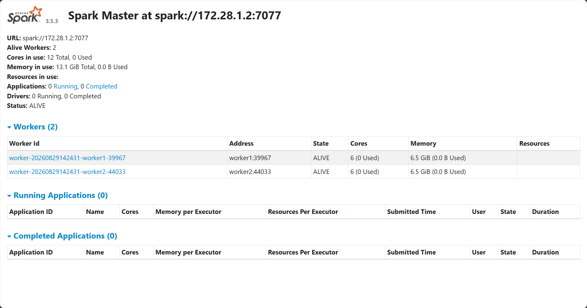
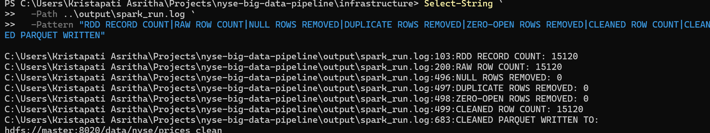
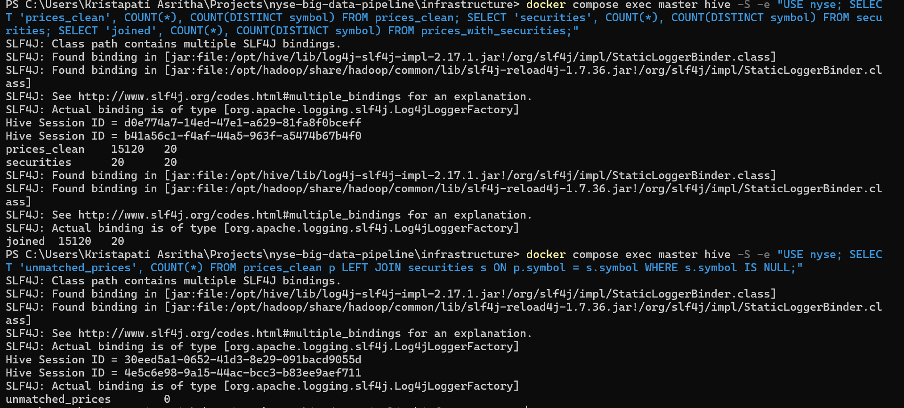
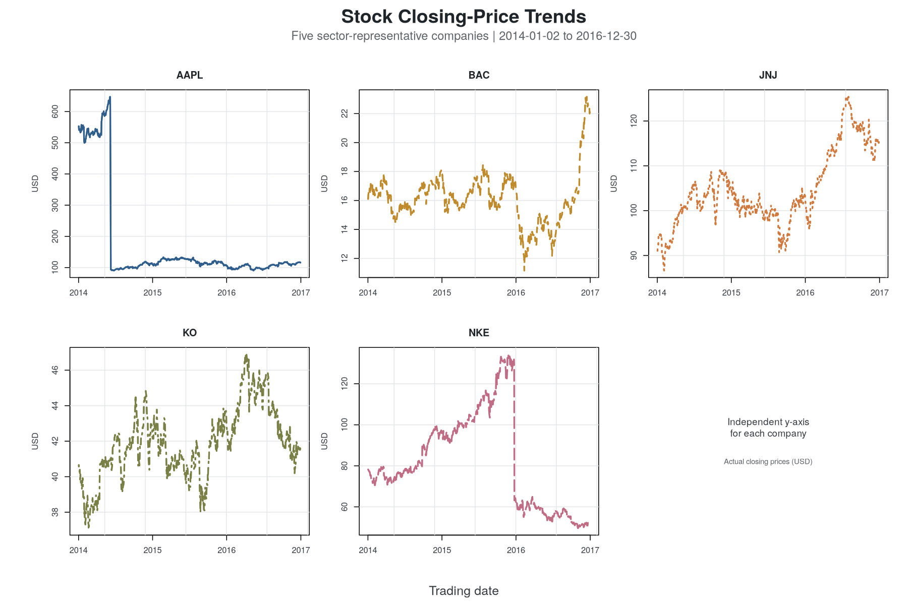
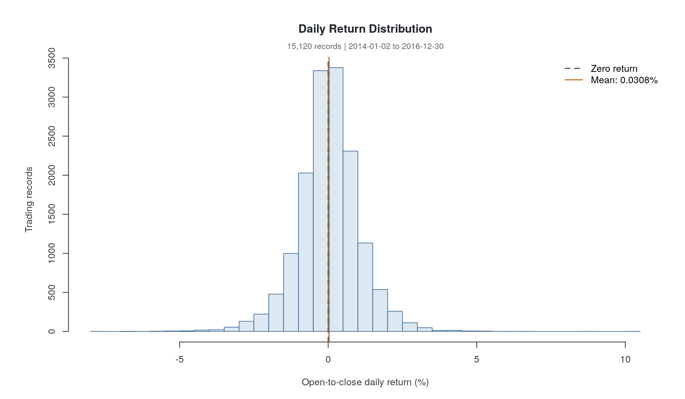
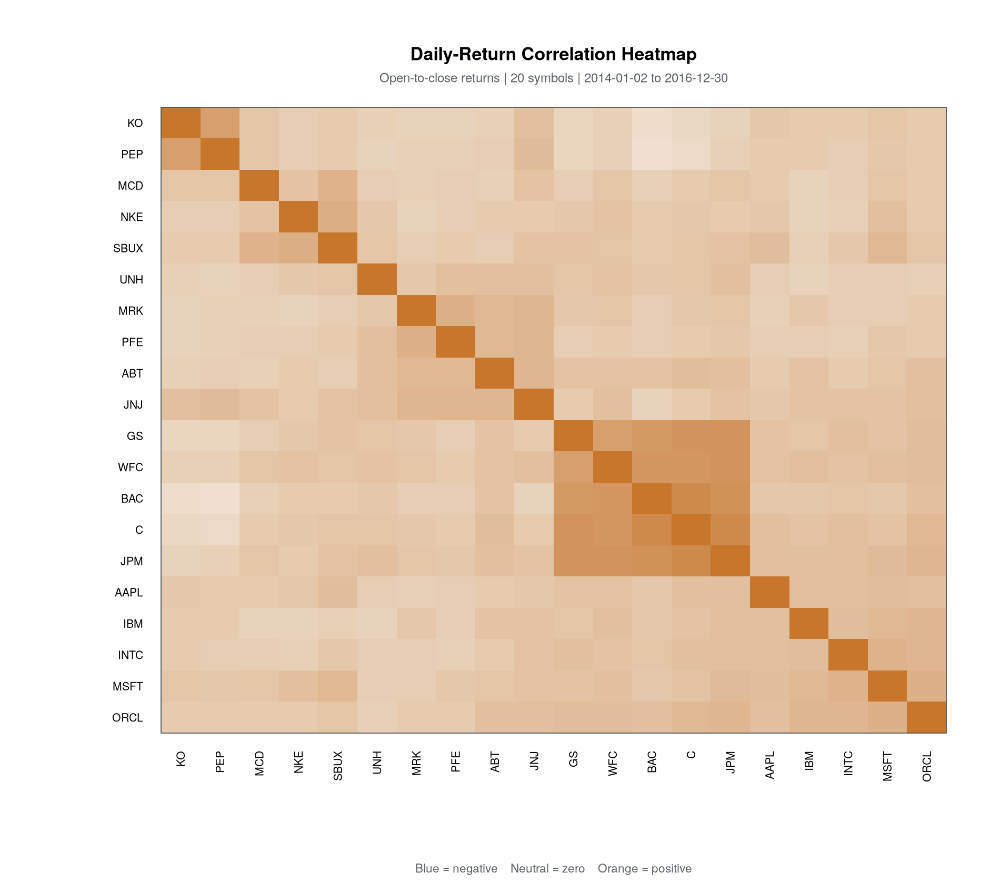

# NYSE Big Data Analytics Pipeline

An end-to-end portfolio project that moves historical NYSE data through a
distributed analytics stack:



The implementation demonstrates PostgreSQL ingestion, Sqoop transfer, HDFS
storage, a required Spark RDD example, typed DataFrame cleaning, Parquet output,
Hive joins and aggregations, and R covariance/correlation analysis.

## Verified results

| Check | Result |
|---|---:|
| Raw and cleaned price rows | 15,120 |
| Securities / stock symbols | 20 |
| Trading dates | 756 |
| Date range | 2014-01-02 to 2016-12-30 |
| Unmatched price rows in Hive join | 0 |
| Monthly sector rows | 180 |
| Mean open-to-close daily return | 0.030763% |
| Daily-return standard deviation | 1.044164% |
| Strongest off-diagonal return correlation | JPM/C = 0.838435 |

The highest average daily return by sector in this subset was Information
Technology (0.0605%), followed by Consumer Staples (0.0499%). Financials had
the highest aggregate volume, and Bank of America had the highest company-level
volume.

## Repository layout

```text
.
|-- config/hadoop/       # tracked override for YARN MapReduce jobs
|-- data/                # local raw and prepared data (CSVs ignored)
|-- hive/                # external tables, views, validation, analytics, export
|-- jdbc/                # JDBC download instructions (JAR ignored)
|-- output/              # generated Hive/R artifacts (ignored)
|-- postgres/            # PostgreSQL staging schema
|-- r/                   # covariance, correlation, and visualization analysis
|-- screenshots/         # verified execution evidence
|-- scripts/             # data preparation and infrastructure bootstrap
|-- spark/               # RDD and DataFrame processing
`-- sqoop-custom/        # custom Sqoop image definition (JAR ignored)
```

The third-party infrastructure repository is cloned locally into
`infrastructure/` and ignored by the parent repository. This avoids publishing a
nested Git repository while preserving the required configuration change under
`config/hadoop/`.

## Prerequisites

- Windows PowerShell, Git, and Docker Desktop
- Python 3.10 or newer
- A Kaggle account for the source dataset
- About 15 GB of free disk space for Docker images and data

The validated stack uses Hadoop 3.3.6, Spark 3.5.3, Hive 3.1.3, PostgreSQL 16,
Sqoop 1.4.7, PostgreSQL JDBC 42.7.7, and R 4.5.1.

## Reproduce the pipeline

Run these commands from the repository root in PowerShell.

### 1. Prepare configuration and data

```powershell
Copy-Item .env.example .env
# Edit .env and replace change-me with a local-only password.

.\scripts\setup_infrastructure.ps1
```

Download `prices.csv` and `securities.csv` from the
[Kaggle NYSE dataset](https://www.kaggle.com/datasets/dgawlik/nyse) into
`data/raw/`, then prepare the 20-symbol, 2014-2016 subset:

```powershell
python -m venv .venv
.\.venv\Scripts\Activate.ps1
python -m pip install -r requirements.txt
python .\scripts\prepare_nyse_data.py
```

### 2. Build and start Hadoop, Spark, and Hive

```powershell
docker build -t hadoop-hive-spark-base:latest .\infrastructure\base
docker build -t hadoop-hive-spark-master:latest .\infrastructure\master
docker build -t hadoop-hive-spark-worker:latest .\infrastructure\worker
docker build -t hadoop-hive-spark-history:latest .\infrastructure\history

docker compose -f .\infrastructure\docker-compose.yml up -d `
  metastore master worker1 worker2 history
```

The bootstrap clone disables Git's CRLF conversion so Linux entrypoint scripts
remain executable inside the containers. It also applies the tracked
`mapred-site.xml` override required by YARN's `MRAppMaster`.

### 3. Load PostgreSQL staging tables

```powershell
docker run -d --name nyse-postgres `
  --network infrastructure_sparknet `
  -p 5433:5432 `
  --env-file .env `
  postgres:16

docker cp .\postgres\create_staging_tables.sql nyse-postgres:/tmp/create_staging_tables.sql
docker cp .\data\processed\prices_staging.csv nyse-postgres:/tmp/prices_staging.csv
docker cp .\data\processed\securities_staging.csv nyse-postgres:/tmp/securities_staging.csv

docker exec nyse-postgres psql -U nyseuser -d nyse `
  -f /tmp/create_staging_tables.sql
docker exec nyse-postgres psql -U nyseuser -d nyse `
  -c "TRUNCATE staging_prices, staging_securities;"
docker exec nyse-postgres psql -U nyseuser -d nyse `
  -c "\copy staging_prices FROM '/tmp/prices_staging.csv' CSV HEADER"
docker exec nyse-postgres psql -U nyseuser -d nyse `
  -c "\copy staging_securities FROM '/tmp/securities_staging.csv' CSV HEADER"
```

### 4. Import PostgreSQL tables into HDFS with Sqoop

Download the driver using the commands in `jdbc/README.md`, then build the
custom image:

```powershell
docker build -t nyse-sqoop:1.4.7 .\sqoop-custom
docker compose -f .\infrastructure\docker-compose.yml exec master `
  hdfs dfs -mkdir -p /data/nyse
docker compose -f .\infrastructure\docker-compose.yml exec master `
  hdfs dfs -chmod -R 777 /data/nyse

$NYSE_PASSWORD = Read-Host "PostgreSQL password"
```

Import prices:

```powershell
docker run --rm --network infrastructure_sparknet nyse-sqoop:1.4.7 `
  sqoop import `
  -D mapreduce.framework.name=local `
  -D fs.defaultFS=hdfs://master:8020 `
  --connect jdbc:postgresql://nyse-postgres:5432/nyse `
  --username nyseuser --password $NYSE_PASSWORD `
  --driver org.postgresql.Driver `
  --table staging_prices `
  --target-dir /data/nyse/prices_raw `
  --delete-target-dir --num-mappers 1 --as-textfile
```

Repeat for securities by changing the table to `staging_securities` and the
target directory to `/data/nyse/securities_raw`.

### 5. Run Spark processing

```powershell
docker cp .\spark\process_nyse.py infrastructure-master-1:/tmp/process_nyse.py
docker compose -f .\infrastructure\docker-compose.yml exec master `
  spark-submit --master spark://master:7077 /tmp/process_nyse.py

docker compose -f .\infrastructure\docker-compose.yml exec master `
  hdfs dfs -ls /data/nyse/prices_clean
```

The Spark job prints the RDD count and sample, applies an explicit schema, drops
nulls and duplicates, filters zero opening prices, calculates
`daily_return_pct`, and writes Snappy-compressed Parquet.

### 6. Create and validate Hive analytics

HiveServer2 is unstable in the upstream image, so this project intentionally
uses the working Hive CLI.

```powershell
docker cp .\hive\setup_hive.sql infrastructure-master-1:/tmp/setup_hive.sql
docker cp .\hive\validate_hive.sql infrastructure-master-1:/tmp/validate_hive.sql
docker cp .\hive\analytics.sql infrastructure-master-1:/tmp/analytics.sql
docker cp .\hive\export_for_r.sql infrastructure-master-1:/tmp/export_for_r.sql

docker compose -f .\infrastructure\docker-compose.yml exec master hive -f /tmp/setup_hive.sql
docker compose -f .\infrastructure\docker-compose.yml exec master hive -f /tmp/validate_hive.sql
docker compose -f .\infrastructure\docker-compose.yml exec master hive -f /tmp/analytics.sql
docker compose -f .\infrastructure\docker-compose.yml exec master hive -f /tmp/export_for_r.sql
```

The securities import is not quoted CSV, so `setup_hive.sql` uses `RegexSerDe`
to protect embedded commas in sub-industry and headquarters fields. Hive 3.1.3
removed `CREATE INDEX`; Parquet column pruning and predicate pushdown are used
instead.

### 7. Run R analysis

```powershell
docker compose -f .\infrastructure\docker-compose.yml exec master `
  hdfs dfs -getmerge /data/nyse/r_export /tmp/nyse_for_r.csv

docker cp infrastructure-master-1:/tmp/nyse_for_r.csv .\output\nyse_for_r.csv

docker run --rm -v "${PWD}:/project" r-base:4.5.1 `
  Rscript /project/r/analyze_nyse.R /project
```

The R script uses only base R and writes covariance/correlation matrices, a
summary, stock-price small multiples, a return histogram, and a clustered
correlation heatmap into `output/r_analysis/`.

## Execution evidence

| Spark cluster | Spark processing | Hive validation |
|---|---|---|
|  |  |  |

| Price trends | Return distribution | Correlation heatmap |
|---|---|---|
|  |  |  |

Additional evidence in `screenshots/` covers Docker services, HDFS inputs and
Parquet output, Hive tables and analytics, the NameNode and YARN interfaces, and
Spark History Server.

## Interpretation notes

- `daily_return_pct` is the open-to-close return for each trading day, not a
  close-to-close total return.
- Source closing prices are unadjusted. Corporate actions such as stock splits
  can create discontinuities, so daily-return correlations are more useful than
  raw-price correlations for comparative interpretation.
- This environment is designed for local demonstration, not production. The
  permissive HDFS mode is limited to the isolated Docker network.
